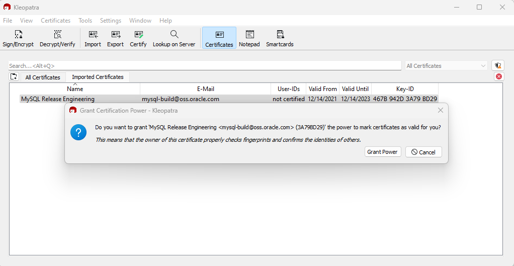

#### 2.1.4.3 Verificação de Assinaturas Usando o Gpg4win para Windows

A seção 2.1.4.2, “Verificação de Assinaturas Usando GnuPG”, descreve como verificar os downloads do MySQL usando o GPG. Esse guia também se aplica ao Microsoft Windows, mas outra opção é usar uma ferramenta de interface gráfica como o Gpg4win. Você pode usar uma ferramenta diferente, mas nossos exemplos são baseados no Gpg4win e utilizam sua interface gráfica integrada `Kleopatra`.

Faça o download e instale o Gpg4win, inicie o Kleopatra e adicione o certificado da MySQL Release Engineering. Isso é feito clicando em Arquivo, Procurar no Servidor. Digite “MySQL Release Engineering” na caixa de pesquisa e pressione Pesquisar.

**Figura 2.1 Kleopatra: Assistente de Procurar no Servidor: Encontrando um Certificado**

Selecione o certificado “MySQL Release Engineering”. O ID da Chave deve referenciar “3A79 BD29”, ou escolha Detalhes... para confirmar que o certificado está válido. Agora, importe-o clicando em Importar. Quando o diálogo de importação for exibido, escolha Ok, e este certificado deve agora estar listado na aba Certificados Importado.

Em seguida, conceda confiança ao certificado. Selecione nosso certificado, então, no menu principal, selecione Certificados, Alterar Poder de Certificação e clique em Conceder Poder.

**Figura 2.2 Kleopatra: Conceder Poder de Certificação para MySQL Release Engineering**

Em seguida, verifique o arquivo de pacote do MySQL baixado. Isso requer arquivos tanto para o arquivo empacotado quanto para a assinatura. O arquivo de assinatura deve ter o mesmo nome que o arquivo empacotado, mas com a extensão `.asc` anexada, como mostrado no exemplo na tabela a seguir. A assinatura está vinculada na página de downloads para cada produto do MySQL. Você deve criar o arquivo `.asc` com essa assinatura.

**Tabela 2.2 Arquivos de pacote e assinaturas do MySQL para o MSI do MySQL Server para Microsoft Windows**

<table><col style="width: 25%"/><col style="width: 75%"/><thead><tr> <th>Tipo de arquivo</th> <th>Nome do arquivo</th> </tr></thead><tbody><tr> <td>Arquivo de distribuição</td> <td><code>mysql-8.4.6-winx64.msi</code></td> </tr><tr> <td>Arquivo de assinatura</td> <td><code>mysql-8.4.6-winx64.msi.asc</code></td> </tr></tbody></table>

Certifique-se de que ambos os arquivos estejam armazenados no mesmo diretório e, em seguida, execute o seguinte comando para verificar a assinatura do arquivo de distribuição. Carregue o diálogo a partir do Arquivo, Desencriptar/Verificar Arquivos..., e então escolha o arquivo `.asc`.

Os dois resultados mais comuns parecem as seguintes figuras; e embora o aviso "Os dados não puderam ser verificados." pareça problemático, a verificação do arquivo passou com sucesso. Para obter informações adicionais sobre o que esse aviso significa, clique em Mostrar Log de Auditoria e compare-o com a Seção 2.1.4.2, “Verificação de assinaturas usando GnuPG”. Agora você pode executar o arquivo MSI.

**Figura 2.3 Kleopatra: o Diálogo de Resultados de Desencriptação e Verificação: Sucesso**

Ver um erro como Verificação falhou: Sem dados. significa que o arquivo é inválido. Não execute o arquivo MSI se você ver esse erro.

**Figura 2.4 Kleopatra: o Diálogo de Resultados de Desencriptação e Verificação: Má**

