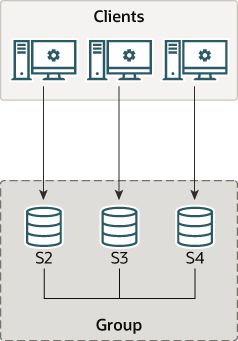

### 20.2.1 Deploying Group Replication in Single-Primary Mode

Each of the MySQL server instances in a group can run on an independent physical host machine, which is the recommended way to deploy Group Replication. This section explains how to create a replication group with three MySQL Server instances, each running on a different host machine. See Section 20.2.2, “Deploying Group Replication Locally” for information about deploying multiple MySQL server instances running Group Replication on the same host machine, for example for testing purposes.

**Figure 20.7 Group Architecture**

This tutorial explains how to get and deploy MySQL Server with the Group Replication plugin, how to configure each server instance before creating a group, and how to use Performance Schema monitoring to verify that everything is working correctly.