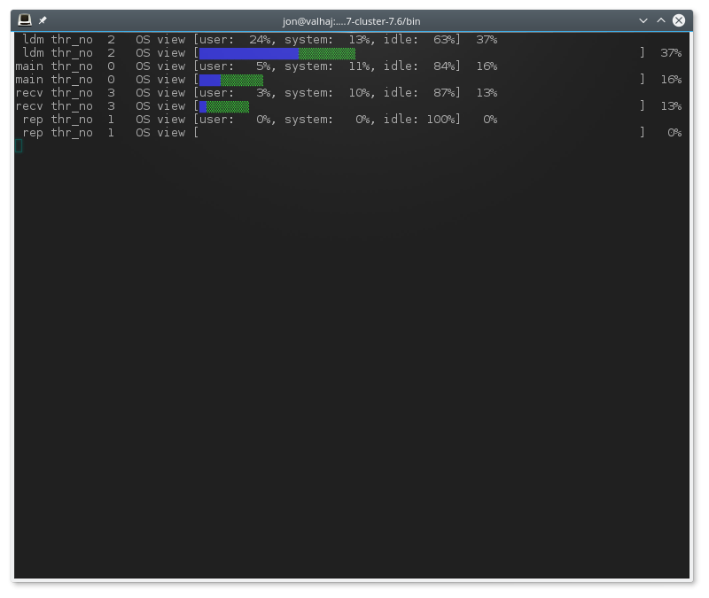

### 25.5.29 ndb_top — View CPU usage information for NDB threads

**ndb_top** displays running information in the terminal about CPU usage by NDB threads on an NDB Cluster data node. Each thread is represented by two rows in the output, the first showing system statistics, the second showing the measured statistics for the thread.

**ndb_top** is available beginning with MySQL NDB Cluster 7.6.3.

#### Usage

```
ndb_top [-h hostname] [-t port] [-u user] [-p pass] [-n node_id]
```

**ndb_top** connects to a MySQL Server running as an SQL node of the cluster. By default, it attempts to connect to a **mysqld** running on `localhost` and port 3306, as the MySQL `root` user with no password specified. You can override the default host and port using, respectively, `--host` (`-h`) and `--port` (`-t`). To specify a MySQL user and password, use the `--user` (`-u`) and `--passwd` (`-p`) options. This user must be able to read tables in the `ndbinfo` database (**ndb_top** uses information from `ndbinfo.cpustat` and related tables).

For more information about MySQL user accounts and passwords, see Section 8.2, “Access Control and Account Management”.

Output is available as plain text or an ASCII graph; you can specify this using the `--text` (`-x`) and `--graph` (`-g`) options, respectively. These two display modes provide the same information; they can be used concurrently. At least one display mode must be in use.

Color display of the graph is supported and enabled by default (`--color` or `-c` option). With color support enabled, the graph display shows OS user time in blue, OS system time in green, and idle time as blank. For measured load, blue is used for execution time, yellow for send time, red for time spent in send buffer full waits, and blank spaces for idle time. The percentage shown in the graph display is the sum of percentages for all threads which are not idle. Colors are not currently configurable; you can use grayscale instead by using `--skip-color`.

The sorted view (`--sort`, `-r`) is based on the maximum of the measured load and the load reported by the OS. Display of these can be enabled and disabled using the `--measured-load` (`-m`) and `--os-load` (`-o`) options. Display of at least one of these loads must be enabled.

The program tries to obtain statistics from a data node having the node ID given by the `--node-id` (`-n`) option; if unspecified, this is 1. **ndb_top** cannot provide information about other types of nodes.

The view adjusts itself to the height and width of the terminal window; the minimum supported width is 76 characters.

Once started, **ndb_top** runs continuously until forced to exit; you can quit the program using `Ctrl-C`. The display updates once per second; to set a different delay interval, use `--sleep-time` (`-s`).

Note

**ndb_top** is available on macOS, Linux, and Solaris. It is not currently supported on Windows platforms.

The following table includes all options that are specific to the NDB Cluster program **ndb_top**. Additional descriptions follow the table.

**Table 25.50 Command-line options used with the program ndb_top**

<table frame="box" rules="all"><col style="width: 33%"/><col style="width: 34%"/><col style="width: 33%"/><thead><tr> <th scope="col">Format</th> <th scope="col">Description</th> <th scope="col">Added, Deprecated, or Removed</th> </tr></thead><tbody><tr> <th scope="row"><p> <code>--color</code>, </p><p> <code class="option"> -c </code> </p></th> <td>Show ASCII graphs in color; use --skip-colors to disable</td> <td><p> (Supported in all NDB releases based on MySQL 8.0) </p></td> </tr></tbody><tbody><tr> <th scope="row"><p> <code class="option"> --defaults-extra-file=path </code> </p></th> <td>Read given file after global files are read</td> <td><p> (Supported in all NDB releases based on MySQL 8.0) </p></td> </tr></tbody><tbody><tr> <th scope="row"><p> <code class="option"> --defaults-file=path </code> </p></th> <td>Read default options from given file only</td> <td><p> (Supported in all NDB releases based on MySQL 8.0) </p></td> </tr></tbody><tbody><tr> <th scope="row"><p> <code class="option"> --defaults-group-suffix=string </code> </p></th> <td>Also read groups with concat(group, suffix)</td> <td><p> (Supported in all NDB releases based on MySQL 8.0) </p></td> </tr></tbody><tbody><tr> <th scope="row"><p> <code>--graph</code>, </p><p> <code class="option"> -g </code> </p></th> <td>Display data using graphs; use --skip-graphs to disable</td> <td><p> (Supported in all NDB releases based on MySQL 8.0) </p></td> </tr></tbody><tbody><tr> <th scope="row"><p> <code class="option"> --help </code> </p></th> <td>Show program usage information</td> <td><p> (Supported in all NDB releases based on MySQL 8.0) </p></td> </tr></tbody><tbody><tr> <th scope="row"><p> <code>--host=string</code>, </p><p> <code class="option"> <a class="link" href="mysql-cluster-programs-ndb-top.html#option_ndb_top_host">-h string</a> </code> </p></th> <td>Host name or IP address of MySQL Server to connect to</td> <td><p> (Supported in all NDB releases based on MySQL 8.0) </p></td> </tr></tbody><tbody><tr> <th scope="row"><p> <code class="option"> --login-path=path </code> </p></th> <td>Read given path from login file</td> <td><p> (Supported in all NDB releases based on MySQL 8.0) </p></td> </tr></tbody><tbody><tr> <th scope="row"><p> <code>--measured-load</code>, </p><p> <code class="option"> -m </code> </p></th> <td>Show measured load by thread</td> <td><p> (Supported in all NDB releases based on MySQL 8.0) </p></td> </tr></tbody><tbody><tr> <th scope="row"><p> <code class="option"> --no-defaults </code> </p></th> <td>Do not read default options from any option file other than login file</td> <td><p> (Supported in all NDB releases based on MySQL 8.0) </p></td> </tr></tbody><tbody><tr> <th scope="row"><p> <code>--node-id=#</code>, </p><p> <code class="option"> <a class="link" href="mysql-cluster-programs-ndb-top.html#option_ndb_top_node-id">-n #</a> </code> </p></th> <td>Watch node having this node ID</td> <td><p> (Supported in all NDB releases based on MySQL 8.0) </p></td> </tr></tbody><tbody><tr> <th scope="row"><p> <code>--os-load</code>, </p><p> <code class="option"> -o </code> </p></th> <td>Show load measured by operating system</td> <td><p> (Supported in all NDB releases based on MySQL 8.0) </p></td> </tr></tbody><tbody><tr> <th scope="row"><p> <code>--password=password</code>, </p><p> <code class="option"> <a class="link" href="mysql-cluster-programs-ndb-top.html#option_ndb_top_password">-p password</a> </code> </p></th> <td>Connect using this password</td> <td><p> (Supported in all NDB releases based on MySQL 8.0) </p></td> </tr></tbody><tbody><tr> <th scope="row"><p> <code>--port=#</code>, </p><p> <code class="option"><a class="link" href="mysql-cluster-programs-ndb-top.html#option_ndb_top_port">-P #</a></code> (&gt;=7.6.6) </p></th> <td>Port number to use when connecting to MySQL Server</td> <td><p> (Supported in all NDB releases based on MySQL 8.0) </p></td> </tr></tbody><tbody><tr> <th scope="row"><p> <code class="option"> --print-defaults </code> </p></th> <td>Print program argument list and exit</td> <td><p> (Supported in all NDB releases based on MySQL 8.0) </p></td> </tr></tbody><tbody><tr> <th scope="row"><p> <code>--sleep-time=#</code>, </p><p> <code class="option"> <a class="link" href="mysql-cluster-programs-ndb-top.html#option_ndb_top_sleep-time">-s #</a> </code> </p></th> <td>Time to wait between display refreshes, in seconds</td> <td><p> (Supported in all NDB releases based on MySQL 8.0) </p></td> </tr></tbody><tbody><tr> <th scope="row"><p> <code>--socket=path</code>, </p><p> <code class="option"> <a class="link" href="mysql-cluster-programs-ndb-top.html#option_ndb_top_socket">-S path</a> </code> </p></th> <td>Socket file to use for connection</td> <td><p> (Supported in all NDB releases based on MySQL 8.0) </p></td> </tr></tbody><tbody><tr> <th scope="row"><p> <code>--sort</code>, </p><p> <code class="option"> -r </code> </p></th> <td>Sort threads by usage; use --skip-sort to disable</td> <td><p> (Supported in all NDB releases based on MySQL 8.0) </p></td> </tr></tbody><tbody><tr> <th scope="row"><p> <code>--text</code>, </p><p> <code>-t</code> (&gt;=7.6.6) </p></th> <td>Display data using text</td> <td><p> (Supported in all NDB releases based on MySQL 8.0) </p></td> </tr></tbody><tbody><tr> <th scope="row"><p> <code class="option"> --usage </code> </p></th> <td>Show program usage information; same as --help</td> <td><p> (Supported in all NDB releases based on MySQL 8.0) </p></td> </tr></tbody><tbody><tr> <th scope="row"><p> <code>--user=name</code>, </p><p> <code class="option"> <a class="link" href="mysql-cluster-programs-ndb-top.html#option_ndb_top_user">-u name</a> </code> </p></th> <td>Connect as this MySQL user</td> <td><p> (Supported in all NDB releases based on MySQL 8.0) </p></td> </tr></tbody></table>

#### Additional Options

* `--color`, `-c`

  <table frame="box" rules="all" summary="Properties for color"><col style="width: 30%"/><col style="width: 70%"/><tbody><tr><th>Command-Line Format</th> <td><code>--color</code></td> </tr></tbody></table>

  Show ASCII graphs in color; use `--skip-colors` to disable.

* `--defaults-extra-file`

  <table frame="box" rules="all" summary="Properties for defaults-extra-file"><col style="width: 30%"/><col style="width: 70%"/><tbody><tr><th>Command-Line Format</th> <td><code>--defaults-extra-file=path</code></td> </tr><tr><th>Type</th> <td>String</td> </tr><tr><th>Default Value</th> <td><code>[none]</code></td> </tr></tbody></table>

  Read given file after global files are read.

* `--defaults-file`

  <table frame="box" rules="all" summary="Properties for defaults-file"><col style="width: 30%"/><col style="width: 70%"/><tbody><tr><th>Command-Line Format</th> <td><code>--defaults-file=path</code></td> </tr><tr><th>Type</th> <td>String</td> </tr><tr><th>Default Value</th> <td><code>[none]</code></td> </tr></tbody></table>

  Read default options from given file only.

* `--defaults-group-suffix`

  <table frame="box" rules="all" summary="Properties for defaults-group-suffix"><col style="width: 30%"/><col style="width: 70%"/><tbody><tr><th>Command-Line Format</th> <td><code>--defaults-group-suffix=string</code></td> </tr><tr><th>Type</th> <td>String</td> </tr><tr><th>Default Value</th> <td><code>[none]</code></td> </tr></tbody></table>

  Also read groups with concat(group, suffix).

* `--graph`, `-g`

  <table frame="box" rules="all" summary="Properties for graph"><col style="width: 30%"/><col style="width: 70%"/><tbody><tr><th>Command-Line Format</th> <td><code>--graph</code></td> </tr></tbody></table>

  Display data using graphs; use `--skip-graphs` to disable. This option or `--text` must be true; both options may be true.

* `--help`, `-?`

  <table frame="box" rules="all" summary="Properties for help"><col style="width: 30%"/><col style="width: 70%"/><tbody><tr><th>Command-Line Format</th> <td><code>--help</code></td> </tr></tbody></table>

  Show program usage information.

* [`--host`=*`name]`*, `-h`

  <table frame="box" rules="all" summary="Properties for host"><col style="width: 30%"/><col style="width: 70%"/><tbody><tr><th>Command-Line Format</th> <td><code>--host=string</code></td> </tr><tr><th>Type</th> <td>String</td> </tr><tr><th>Default Value</th> <td><code>localhost</code></td> </tr></tbody></table>

  Host name or IP address of MySQL Server to connect to.

* `--login-path`

  <table frame="box" rules="all" summary="Properties for login-path"><col style="width: 30%"/><col style="width: 70%"/><tbody><tr><th>Command-Line Format</th> <td><code>--login-path=path</code></td> </tr><tr><th>Type</th> <td>String</td> </tr><tr><th>Default Value</th> <td><code>[none]</code></td> </tr></tbody></table>

  Read given path from login file.

* `--measured-load`, `-m`

  <table frame="box" rules="all" summary="Properties for measured-load"><col style="width: 30%"/><col style="width: 70%"/><tbody><tr><th>Command-Line Format</th> <td><code>--measured-load</code></td> </tr></tbody></table>

  Show measured load by thread. This option or `--os-load` must be true; both options may be true.

* `--no-defaults`

  <table frame="box" rules="all" summary="Properties for color"><col style="width: 30%"/><col style="width: 70%"/><tbody><tr><th>Command-Line Format</th> <td><code>--color</code></td> </tr></tbody></table>0

  Do not read default options from any option file other than login file.

* [`--node-id`=*`#]`*, `-n`

  <table frame="box" rules="all" summary="Properties for color"><col style="width: 30%"/><col style="width: 70%"/><tbody><tr><th>Command-Line Format</th> <td><code>--color</code></td> </tr></tbody></table>1

  Watch the data node having this node ID.

* `--os-load`, `-o`

  <table frame="box" rules="all" summary="Properties for color"><col style="width: 30%"/><col style="width: 70%"/><tbody><tr><th>Command-Line Format</th> <td><code>--color</code></td> </tr></tbody></table>2

  Show load measured by operating system. This option or `--measured-load` must be true; both options may be true.

* [`--password`=*`password]`*, `-p`

  <table frame="box" rules="all" summary="Properties for color"><col style="width: 30%"/><col style="width: 70%"/><tbody><tr><th>Command-Line Format</th> <td><code>--color</code></td> </tr></tbody></table>3

  Connect to a MySQL Server using this password and the MySQL user specified by `--user`.

  This password is associated with a MySQL user account only, and is not related in any way to the password used with encrypted `NDB` backups.

* [`--port`=*`#]`*, `-P`

  <table frame="box" rules="all" summary="Properties for color"><col style="width: 30%"/><col style="width: 70%"/><tbody><tr><th>Command-Line Format</th> <td><code>--color</code></td> </tr></tbody></table>4

  Port number to use when connecting to MySQL Server.

  (Formerly, the short form for this option was `-t`, which was repurposed as the short form of `--text`.)

* `--print-defaults`

  <table frame="box" rules="all" summary="Properties for color"><col style="width: 30%"/><col style="width: 70%"/><tbody><tr><th>Command-Line Format</th> <td><code>--color</code></td> </tr></tbody></table>5

  Print program argument list and exit.

* [`--sleep-time`=*`seconds]`*, `-s`

  <table frame="box" rules="all" summary="Properties for color"><col style="width: 30%"/><col style="width: 70%"/><tbody><tr><th>Command-Line Format</th> <td><code>--color</code></td> </tr></tbody></table>6

  Time to wait between display refreshes, in seconds.

* `--socket=path/to/file`, `-S`

  <table frame="box" rules="all" summary="Properties for color"><col style="width: 30%"/><col style="width: 70%"/><tbody><tr><th>Command-Line Format</th> <td><code>--color</code></td> </tr></tbody></table>7

  Use the specified socket file for the connection.

* `--sort`, `-r`

  <table frame="box" rules="all" summary="Properties for color"><col style="width: 30%"/><col style="width: 70%"/><tbody><tr><th>Command-Line Format</th> <td><code>--color</code></td> </tr></tbody></table>8

  Sort threads by usage; use `--skip-sort` to disable.

* `--text`, `-t`

  <table frame="box" rules="all" summary="Properties for color"><col style="width: 30%"/><col style="width: 70%"/><tbody><tr><th>Command-Line Format</th> <td><code>--color</code></td> </tr></tbody></table>9

  Display data using text. This option or `--graph` must be true; both options may be true.

  (The short form for this option was `-x` in previous versions of NDB Cluster, but this is no longer supported.)

* `--usage`

  <table frame="box" rules="all" summary="Properties for defaults-extra-file"><col style="width: 30%"/><col style="width: 70%"/><tbody><tr><th>Command-Line Format</th> <td><code>--defaults-extra-file=path</code></td> </tr><tr><th>Type</th> <td>String</td> </tr><tr><th>Default Value</th> <td><code>[none]</code></td> </tr></tbody></table>0

  Display help text and exit; same as `--help`.

* [`--user`=*`name]`*, `-u`

  <table frame="box" rules="all" summary="Properties for defaults-extra-file"><col style="width: 30%"/><col style="width: 70%"/><tbody><tr><th>Command-Line Format</th> <td><code>--defaults-extra-file=path</code></td> </tr><tr><th>Type</th> <td>String</td> </tr><tr><th>Default Value</th> <td><code>[none]</code></td> </tr></tbody></table>1

  Connect as this MySQL user. Normally requires a password supplied by the `--password` option.

**Sample Output.** The next figure shows **ndb_top** running in a terminal window on a Linux system with an **ndbmtd**") data node under a moderate load. Here, the program has been invoked using **ndb_top** `-n8` `-x` to provide both text and graph output:

**Figure 25.5 ndb_top Running in Terminal**



Beginning with NDB 8.0.20, **ndb_top** also shows spin times for threads, displayed in green.